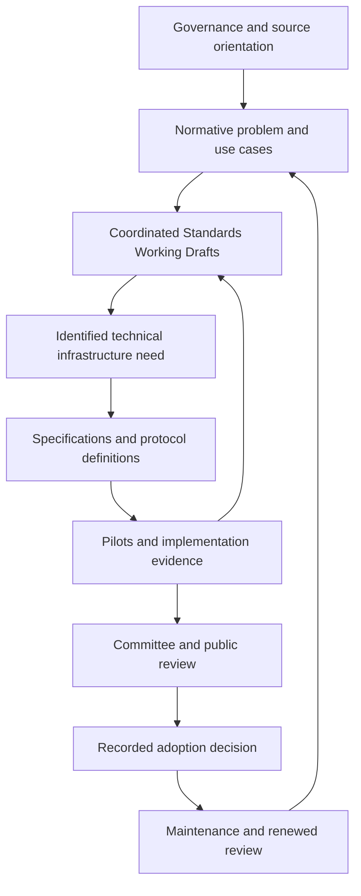

# Comprehensive Development Plan

**Document class:** Informative programme planning  
**Status:** PROVISIONAL — proposed work, not project approval or adopted requirements  
**Version:** 0.1  
**Planning date:** 2026-09-22  
**Basis:** Confirmed programme orientation; [Programme Brief](../../PROGRAMME_BRIEF.md); [ADR-0002](../../decisions/ADR-0002-standards-first-specifications-on-demand.md)  
**Decision record:** [ADR-0003](../../decisions/ADR-0003-epistemic-praxis-development-plan.md)

**Implementation update, 2026-09-22:** The [initial working-draft package](../../publications/README.md) implements the first authoring cycle: five governance drafts and GR-100/110/200/210, templates, synthetic cases and recorded review. M1 governance adoption, formal NWIP approval, independent domain review and participant pilots remain incomplete. No milestone is advanced solely because documents compile.

## 1. Purpose and intended outcome

This plan organizes development of epistemic and practical infrastructure for warranted recognition of reality, evaluation and revision of factual claims, and preservation of relational and generative trajectories. Its motivating problem is the symbolic crisis: instability in the connections among representations, their referents, institutional classifications, and practical trust. This is the programme's source-grounded diagnosis, not a claim that all representations or institutions have become unreliable.

The intended outcome is a family of shared practices and interoperable implementations through which people and institutions can investigate what happened, explain the grounds of a judgment, contest an interpretation, reconstruct changes over time, and understand how action changed conditions for further generation. Future re-recognizability, reinterpretability, and regenerability remain orienting capacities rather than guarantees of complete reconstruction.

The programme follows three distinguishable histories:

1. changes in the situation, relations, capacities, constraints, and possibilities under inquiry;
2. changes in evidence, claims, interpretations, judgments, and institutional responses;
3. changes in categories, methods, models, and recording or recognition regimes.

Their interactions matter. A classification can affect access and subsequent behavior; its efficacy does not establish its truth or legitimacy. A missing record does not establish nonexistence. An authenticated assertion can still be mistaken. Generativity can include maintenance, depletion, domination, or foreclosure as well as beneficial creation.

## 2. Scope, authority, and planning boundaries

This is a development plan, with candidate allocations and exit criteria for review. It does not adopt Standards, authorize external pilots, decide legal obligations, establish a certification body, or resolve open GR theory.

| Publication or artifact | Role in this plan | Authority boundary |
|---|---|---|
| Governance directive or policy | Establish the programme's development, review, decision, and maintenance process | Authority depends on recorded programme adoption |
| Standards-track draft | Define purpose, scope, requirements, and conformance expectations | A draft becomes a Standard only through the established adoption process |
| Specification | Define implementable models, representations, algorithms, or interactions needed by draft requirements | Technical requirements apply within its declared scope and maturity; no automatic Standard status |
| Protocol | Specify participants, interactions, states, transitions, outcomes, and failures | A technical subject described in a Specification or adopted Standard, not a separate authority class |
| Manual and examples | Explain practical use and demonstrate intended behavior | Informative; examples do not add conformance requirements |
| Technical Report | Develop theory, unresolved semantics, comparisons, and research findings | Informative or experimental; no hidden normative dependencies |
| Policy or institutional proposal | Offer mandate-specific adoption, capacity-building, and governance options | Recommendatory; separate institutional decisions remain necessary |

No storage platform, universal trust score, universal generativity metric, cryptographic system, or centralized truth authority is selected. External standards are candidate resources pending gap analysis and tests. Existing publication numbers and paths remain stable. Planning package labels below are not new publication codes.

## 3. Starting position and historical continuity

The repository contains a programme scaffold: governance outlines, preliminary standards scopes, three specification placeholders, an experimental mathematical report, and foundation manuscripts. No adopted technical Standard, validated schema, independent implementation, or completed pilot is evidenced by the present repository.

The earlier [preliminary plan](preliminary_plan.md) is retained as a historical draft. Its specification-first sentence in section 12 conflicts with accepted ADR-0002 and its own section 13. Current sequencing follows ADR-0002: normative need first, technical specification when needed, with pilot feedback before adoption.

The present plan broadens the earlier emphasis on archival loss and AI provenance to the confirmed epistemic and practical purpose. It brings evidence, contestation, institutional uptake, access, and conformance into initial development rather than postponing them until a record model is complete.

## 4. Development architecture

### 4.1 Motivation and objectives

The full programme exceeds the first implementation package. Comprehensive development combines a theory of the problem, a justified institutional process, domain-specific inquiry, operational requirements, technical behavior and evidence of practical effects.

| Motivating problem | Programme objective | Evidence of progress, without promising social outcomes |
|---|---|---|
| Unstable connections between representations and their referents | Make grounds, methods, uncertainty and alternative interpretations inspectable | Reviewers can reconstruct why a claim was made and identify limits or counterevidence |
| Authority and acceptance can conceal weak warrant | Separate evidential assessment, institutional decisions and normative or legal judgments | Cases preserve those distinct judgments and responsible decision makers |
| Histories disappear behind final outputs and current classifications | Preserve relational, generative and epistemic trajectories under explicit limits | Later readers recover consequential changes, historical categories, alternatives and known gaps |
| Recognition and record control shape participation and resources | Support accessible challenge, correction and accountable practical response | Affected participants can exercise the procedure; barriers and unequal burdens are reported |
| Standards themselves can concentrate interpretive and infrastructural power | Establish transparent development, meaningful participation, appeals and maintenance | Decisions, conflicts, objections, resource constraints and routes to revision are inspectable |
| Present action can deplete future generative conditions | Examine capacities, enabling relations, foreclosed options and distribution across time | Pilots trace supported consequences and preserve uncertainty about effects not yet observable |

Restored social trust, epistemic justice and sustainable generativity are long-term aims requiring separate evaluation. Passing tests or publishing a Standard does not demonstrate that those aims have been achieved.

### 4.2 Conceptual and technical separation

The conceptual layers remain metamodel, operational record vocabulary, epistemic representation, normative assessment, jurisprudential interface, institutional governance, political economy, and technical implementation. A record can connect these layers while retaining their distinct sources of warrant and authority.

The six candidate record classes remain Entity, State, Event, Process, Relation, and Property. Their adequacy and identity criteria are research and design questions. Observation, Claim, Evidence, and Interpretation are candidate epistemic roles; their realization as classes, relations, or wrappers remains OPEN. Part II's use of Attribute is not silently equated with Property.

The working development loop is:

Source analysis, synthetic examples, and editorial drafting can begin during governance preparation. Formal project initiation follows coherent governance and a recorded work-item decision. Standards and Specifications can co-evolve; adoption is not a prerequisite for prototyping.

## 5. Coordinated publication portfolio

### 5.1 Substantive domain programme

Each domain has its own questions, sources and reviewer competence. A technically valid record cannot settle these domains by serialization. The [cross-domain programme](cross_domain_programme.md) develops the following allocations, their external sources and a worked institutional case.

| Domain | Initial research and design deliverable | Route into the publication family |
|---|---|---|
| GR foundations and ontology | Source concordance; bounded operational definitions; identity, emergence and formal limitations | GR-TR101/102 inform GR-100/120 through recorded decisions |
| Epistemology and research methods | Warrant, evidential roles, alternative explanations, uncertainty, historical revision and inferential limits | GR-200/210; scoped representation in GR-SPEC-200 |
| Archival and information science | Appraisal, provenance, preservation, absence, custody, description and long-term interpretability | GR-110/140/160 with manuals and preservation profiles |
| Ethics and normative assessment | Value plurality, recognition, harm, responsibility, distribution of burdens and generativity return; reasoned tradeoffs | Informative analysis and GR-110/160/210/400 requirements where operationally justified |
| Jurisprudence and legal procedure | Legal concepts, claimed authority, evidentiary standing, identity, responsibility, rights and remedy under declared contexts | GR-300/310; contextual profiles and separately labelled model rules or policy proposals |
| Programme governance | Participation, representational balance, independence, consensus, appeals, contribution rights and maintenance | Charter, Directives and supporting policies; comparative process study |
| Institutional and public governance | Mandates, decision authority, contestability, oversight, repair and evidence-to-action procedures | GR-400; institutional profiles and governance manuals |
| Public and international policy | Problem analysis, organization-specific mandates, adoption alternatives, costs, capacity, pilots and evaluation | Policy/institutional proposals; technical needs enter the work-item process separately |
| Political economy | Ownership and control, unequal recording capacity, infrastructural dependency, contributions and allocation of benefits | Cross-domain impact studies; requirements review and institution-specific options |
| Technical infrastructure and human use | Semantic interoperability, protocol behavior, security, accessible presentation, validation and maintenance | GR-120/130/140/150; justified Specifications and implementations |

Policy analysis and ethical or jurisprudential research can begin in parallel with governance and source work. Binding legal conclusions, organizational mandates and political choices remain separately warranted. International policy work compares at least a voluntary pilot, shared stewardship where feasible, and use of existing infrastructures or deferral; it identifies the intended organization or class and its actual decision authority before recommending adoption.

### 5.2 Existing project allocation

All allocations below are PROVISIONAL. The current scopes are starting points for work-item review. “Initial” means a bounded contribution to the first demonstrator, not completion of the entire publication.

| Existing project | Normative problem and planned scope | Specification or supporting output triggered by need | Initial evidence and dependency |
|---|---|---|---|
| GR-100 — Foundations and Vocabulary | Distinguish reality, manifestation, representation, claim, evidence, judgment, identity, time, trajectory, and generativity; scope operational definitions | GR-TR101 source analysis; vocabulary mapping used by SPEC-120/200 | Initial: definitions with examples, counterexamples, identity criteria and unresolved cases; foundation traceability |
| GR-110 — Generativity Recording Requirements | Establish the minimum record needed for stated reconstruction and review purposes; record enabling conditions, uncertainty, alternatives and losses | Capture guidance in GR-M101; SPEC-120 record structures | Initial: reconstruct a decision and its grounds without treating a current summary as its full history |
| GR-120 — Generativity Information Model | Define implementation-neutral semantics, identity, temporal relationships, versions, and extension boundaries | GR-SPEC-120 implementable model and identifiers | Initial subset only after GR-100/110/200 needs; test contested identity and loss-aware conversion |
| GR-130 — Generativity Interchange Specification | Existing title retained; standards-track role is interoperability requirements and declared preservation of meaning | GR-SPEC-130 encodings, exchange behavior, protocol bindings and migration rules | Initial portable package; later independent implementations; depends on agreed semantic subset |
| GR-140 — Generativity Presentation Requirements | Make occurrence claims, evidence, inference, uncertainty, disagreement, revisions, omission, and mediation understandable | View profiles and presentation fixtures; machine binding only if reuse requires it | Initial: readers can distinguish current judgment from historical views and a restricted view from a complete archive |
| GR-150 — Conformance and Validation | Define conformance subjects, versions, profiles, test methods, exclusions, and claims | Validation rules and fixtures linked to the relevant Specifications | Initial test design alongside requirements; conformance never certifies substantive truth |
| GR-160 — Preservation, Privacy, Access, and Retention | Preserve interpretability while governing restricted access, correction, sealing, retention, deletion and custodial change | Access and lifecycle behavior in Specifications; preservation profiles and manual guidance | Initial restrictions and unavailable evidence; later migration and continuity trials |
| GR-200 — Epistemic Recording Framework | Distinguish assertions and their authors, targets, methods, evidence roles, perspectives, scope, uncertainty and revisions | GR-SPEC-200 epistemic structures linked to SPEC-120 | Initial: multiple claims about one situation remain attributable and separately revisable |
| GR-210 — Evidence, Interpretation, and Contestation | Make grounds, counterevidence, alternatives, replies, reviews and dispositions inspectable | Review/revision procedures; SPEC-200 interaction semantics where needed | Initial: a challenge can alter a judgment or receive a reasoned disposition without erasing the challenge |
| GR-300 — Jurisprudential Interface | Represent asserted legal context, jurisdiction, source, authority and procedural status without creating legal validity | Informative analysis first; scoped legal metadata profiles after expert review | Initial boundary statement; fuller work after a named institutional use case and relevant expertise |
| GR-310 — Rights, Duties, and Procedural Profiles | Relate access, notice, objection, correction, restriction and review to a declared institutional basis | Mandate- or jurisdiction-specific profiles, reviewed separately | Initial generic procedural needs inform GR-160/210; legal entitlements remain context-specific |
| GR-400 — Governance and Institutional Use | Connect evidence and judgments to accountable decisions, review, practical response, and recorded downstream effects | Organizational profiles, manuals and pilot reports | Initial synthetic decision procedure; later voluntary institutional pilot with a declared mandate |

GR-200 covers representation of epistemic status; GR-210 covers practices of assessment and contestation. GR-120 describes the semantic contract; GR-SPEC-120 realizes it technically. GR-130 and GR-SPEC-130 similarly separate interoperability obligations from concrete exchange behavior. Review identifies duplication before scopes are stabilized.

Normative and political-economy concerns cross the portfolio: whose contributions receive recognition, whose evidence survives, who bears recording costs, who controls access, and whose future possibilities are affected. Initially these are addressed through GR-110/160/210/400 and informative research. A separate normative-assessment publication is DEFERRED until a distinct, testable need and review competence are demonstrated. Generativity return remains an explicitly scoped research and requirements question, not an assumed quantity.

Supporting work includes GR-M101, GR-TR101, GR-TR102, examples, validation artifacts, and later mandate-specific policy proposals. Category-theoretic semantics remain experimental and are not on the critical path for the first demonstrator.

## 6. First development package

Retain the existing proposed identifier and title: **GR/NWIP-001 — Generativity Recording and Presentation Infrastructure**. The [draft proposal](NWIP-001-generativity-recording-and-presentation.md) defines a coordinated package, not an omnibus adopted Standard. Its first objective is to demonstrate a complete cycle of warranted recording, interpretation, challenge, revision, presentation, and practical response.

Use the programme's own documented decisions as the accessible first case. Pair it with a synthetic institutional case so success is not inferred from a single cooperative author. The package draws bounded requirements from GR-100/110/140/150/160/200/210/400 and creates only the SPEC-120/130/200 components those requirements need.

The candidate minimum demonstration includes:

1. A represented situation, a claim, its responsible source, the record creation time, and the time or interval asserted about the situation.
2. A trace linked as evidence for a specified claim, with the method, relevant limitations and at least one materially plausible competing explanation where applicable.
3. A consequential relation or contribution, its proposed continuity criterion, and a grounded account of how it enabled, constrained, preserved, or closed a later possibility.
4. A distinct challenge and response, with a revised or maintained judgment, its reasons, and a recoverable account of what was known earlier where retention and access permit.
5. A distinction between a change in the situation, a change in knowledge, and a change in classification or method.
6. A presentation that exposes relevant uncertainty, attribution, revision, and evidence availability without leaking restricted content; a protected fixture exercises correction and an authorized retention, deletion or access-withdrawal decision, including its effects on derived views.
7. A portable representation and a validation report that declare supported features and preserve disagreement through exchange.
8. A recorded institutional or participant response, plus a follow-up question about consequences; the record does not fabricate evidence for effects not yet observed.

These are proposed demonstration criteria, not mandatory facts about every future record. Unknown, unavailable, restricted, not assessed, and not applicable need distinguishable treatment when relevant. Feasible alternatives and causal-generative claims need their own grounds; the presence of a branch or dependency field does not establish them.

## 7. Candidate requirement themes and traceability

The labels below are planning references only. Stable normative clause identifiers will be assigned in the corresponding Working Drafts.

| Planning theme | Candidate obligation to investigate | Lead projects | Demonstrating case |
|---|---|---|---|
| Attribution and epistemic scope | Identify whose claim is represented, its target, grounds, method and limits | GR-110/200/210 | Accurate provenance attached to a disputed or false assertion |
| Temporal and identity discipline | Distinguish subject continuity, record versions, asserted time and recording/review time | GR-100/120/200 | Backdated report; disputed identity; late evidence |
| Generative trajectory | Ground connections between earlier relations and later conditions; preserve relevant alternatives and loss | GR-110/210 | Same final output, different enabling history or foreclosed options |
| Contestation and revision | Record challenge, response, disposition and revision reasons without forced agreement | GR-210/400 | Unresolved disagreement survives publication and export |
| Protection and availability | Express access, retention and absence without assuming universal disclosure or indefinite retention | GR-160/310 | Restricted evidence, withdrawn access and justified deletion |
| Presentation and practical uptake | Distinguish summaries and reconstructions from the record; expose the basis of action | GR-140/400 | Viewer distinguishes an allegation, a judgment and a decision |
| Interoperability and conformance | Preserve declared semantics and disclose unsupported features or transformations | GR-120/130/150 | Import/export does not silently merge claims or convert unknown into false |

For each candidate clause, the planning record links: motivating problem → source or operational proposal → alternatives → decision → responsible publication → specification dependency → example or test → pilot finding → revision. The [foundation map](foundation_traceability.md) begins the conceptual traceability; it does not confer normative authority.

## 8. Milestones and dependencies

There are no committed delivery dates or staffing assumptions. A milestone advances when its evidence is available; preparation can overlap without bypassing governance or review. These planning milestones do not replace the programme's 00–90 document stages.

| Milestone | Main work and output | Proposed completion evidence | Next work enabled |
|---|---|---|---|
| M0 — Orientation and scope | Source index, conceptual tensions, use cases, objectives, portfolio, comparative standards-development study, cross-domain agenda and candidate NWIP | Sources linked; source practices distinguished from proposed adaptations; current claims distinguished from proposed requirements; sponsor reviews scope | Governance drafting, domain research and bounded conceptual examples |
| M1 — Governance launch | Charter, Directives 1/2, committee mandate, review/decision/appeals, ethics/IP, maintenance and records arrangements | Founding authority, adopted procedures, responsible roles and a simulated contested decision are documented | Formal work-item decisions and committee drafting |
| M2 — Requirements baseline | Coordinated vocabulary and minimum clauses for the first package; conformance subjects; evidence and protection scenarios | Every proposed initial requirement has a purpose, owner, example/test method and known limitation; source conflicts logged | Demand-driven specification work and synthetic implementation |
| M3 — Pilot-ready Specifications | Small semantic model, epistemic binding, portable exchange and necessary interaction behavior | One implementation exercises the complete cycle; negative fixtures and restriction behavior checked; no silent conversion losses | Controlled pilots and independent implementation |
| M4 — Pilot and interoperability evidence | Programme self-pilot and synthetic decision case for the initial package; AI-assisted research and incomplete archive for broader claims as material and capacity permit | Results report usefulness, burden, exclusions, failures and revisions; a separately built consumer/producer pair exchanges declared features when interchange maturity is claimed | Committee stabilization and public-review readiness for the evidenced scope |
| M5 — Review and adoption readiness | Committee review, horizontal review, public review, comment dispositions, revised artifacts and maintenance assignment | Review history and objections are inspectable; significant changes receive appropriate re-review; formal decision and edition are recorded | Publication of only the approved scope |
| M6 — Maintenance and extension | Corrections, compatibility monitoring, periodic review, new domains and optional protocol profiles | Maintainer and review triggers active; migration and withdrawal histories preserved; new needs enter work-item process | Revised editions and evidence-backed expansion |

Epistemic, ethical, jurisprudential, institutional, political-economy, accessibility and technical review begin with scope and requirement formation, with privacy and test design explicit by M2. Before pilots and publication, a review dossier records the applicable domain questions, reviewers and competence, affected perspectives, evidence, conflicts, findings, dispositions and residual limitations. A domain cannot be marked complete merely because a field exists in a schema. An unassessed domain remains visible and limits claims or progression where material.

No external institution is presumed to participate. Real data use depends on the pilot's actual permissions, governance, and protection arrangements.

The [governance and pilot plan](governance_and_pilots.md) supplies detailed proposed gates and cases. Its local gate labels are supporting detail; M0–M6 are the programme-level sequence.

## 9. Conformance design

Conformance is scoped to a subject: record or package, producing implementation, exchange implementation, presentation, archive service, or organizational procedure. A claim identifies the publication and edition, profile, features, limitations, assessment method, and assessor. Passing a syntax validator is one form of evidence, not an assessment of all these subjects.

Assessment distinguishes structural validation, preservation of declared semantic distinctions, protocol behavior, presentation comprehension, procedural performance, and substantive evidential judgment. The last remains contestable and context-dependent; programme conformance does not certify truth, moral goodness, legal admissibility, or complete historical coverage.

The existing proposed Core, Standard, and Deep/archival profile names are retained as unresolved candidates. Profile design first separates capability from recording depth: a small record can still need attribution, uncertainty, restriction and correction. Terminology such as “Standard profile” needs review to avoid confusion with publication status.

First-release criteria concern the bounded cycle in section 6. Wider federation, registries, cryptographic attestations, credential ecosystems, automated confidence aggregation, generativity measurement, and domain-specific legal profiles are DEFERRED until a requirement and credible evaluation justify their cost.

## 10. Protocols, specifications, and external reuse

The [protocol and specification plan](protocol_specification_plan.md) defines candidate interactions and their implementation triggers. An institutional procedure can be tested through a manual workflow before a network protocol is justified. A portable package is sufficient for early exchange if it demonstrates the required semantics.

The [external standards landscape](external_standards_landscape.md) records verified candidate sources and their limits. Before selecting a dependency, a work item records the exact edition, reuse or extension boundary, semantic mismatch, licensing review where needed, maintenance responsibility, and an interoperability experiment. A cited standard is not evidence of compatibility.

Security and integrity requirements derive from the use case: misleading attribution, alteration, unauthorized access, hidden loss during exchange, conflicting revisions, and abusive review requests are concrete test cases. Evidence integrity and source authentication remain distinct from the validity of a claim.

## 11. Responsibilities and working rhythm

### 11.1 Learning from established standards development

The [ISO/IEC, IEEE and WTO comparative study](standards_development_comparison.md) is a design input. It separates official source practice from the programme's proposed adoption, adaptation or deferral. The programme does not claim ISO or IEEE affiliation or procedural conformity.

Governance drafting evaluates transparent scope and work-item initiation; meaningful stakeholder participation and balance; documented consensus with reasons for unresolved objections; review and decision records; independent appeals; clear drafting and conformance boundaries; contribution/IP arrangements; and maintenance. Exact voting rules, timelines, membership structures and patent policies remain explicit local choices.

Two organizational approaches receive comparison: participation by individual experts and affected people, and organizational representation with safeguards for less-resourced participants. A hybrid is a candidate rather than an assumed solution. For a small programme, combining administrative roles is possible only with disclosed conflicts and an actual route for independent consideration of contested decisions.

The first governance drafting dossier records each borrowed mechanism, its purpose, its source, why it is proportionate here, its cost, the alternative, and how its effectiveness will be tested. A list of well-known standards bodies is not evidence that the programme's governance is credible.

### 11.2 Responsibilities and work cycles

Roles are proposed and unassigned unless separately recorded. A programme sponsor coordinates scope; the founding authority establishes governance; a designated editor owns each active deliverable; conceptual and epistemic reviewers assess interpretation; implementers test realizability; affected participants assess contestability and burden; access/ethics reviewers assess protection; the maintenance role owns published artifacts. The programme documents combined roles and conflicts where a small team cannot separate every function.

Each work cycle selects a small set of requirements and cases, drafts the relevant text, tests the proposed behavior, records disagreements and decisions, and updates dependencies. Parallel work is useful for source analysis, governance and use-case preparation; mutually dependent normative clauses are reviewed together. External participation, organizational structures and sustained staffing remain planning questions rather than existing commitments.

## 12. Immediate work queue

| Order | Concrete next deliverable | Responsible role, currently unassigned | Completion evidence |
|---|---|---|---|
| 1 | Review this plan, draft NWIP-001, foundation map, comparative study and cross-domain agenda; select the bounded first case | Sponsor and programme editor | Recorded objectives, scope, exclusions, adaptations, unresolved questions and chosen case |
| 2 | Draft Charter and Directives 1/2 with the missing governance procedures and source-to-local-choice rationale | Founding authority and governance editor | Coherent launch package and explicit decisions on participation, consensus, appeals, IP and maintenance |
| 3 | Build a synthetic example distinguishing situation, claims, evidence, interpretation, decision and revision | Epistemic editor and pilot lead | Two competing accounts, changed evidence, protected material and a traced generative consequence |
| 4 | Prepare the coordinated GR-100/110/200/210 requirements subset with GR-140/150/160/400 constraints | Assigned document editors | Requirement-to-case and source-to-definition maps; no premature schema dependence |
| 5 | After governance launch, decide NWIP scope and Specification work items | Established decision body | Recorded decisions, owners and technical needs; pending proposals remain pending |
| 6 | Implement the smallest representation and interactions needed for the chosen cycle | Implementer and reviewer | Demonstration plus failures and burden report; revision proposals returned to draft requirements |

This table preserves the initial work sequence. Items 2–4 now have first authoring outputs in the [working-draft package](../../publications/README.md): governance texts, P1 and the four preparatory technical drafts. Their institutional decisions and empirical assessment evidence are still incomplete. Item 5 awaits governance launch; item 6 has not begun. The [review record](../reviews/initial_working_draft_review.md) identifies what was checked and what remains unassessed.

## 13. Risks, decisions, and expansion criteria

| Risk or unresolved choice | Planned response and evidence |
|---|---|
| Ontology or formalism dictates what counts as real | Preserve source distinctions and explicit operational scope; test overlooked and disputed cases |
| Records turn acceptance or consensus into truth | Separate claim, assessment, institutional action and grounds; use counterexamples |
| Scope expands beyond team capacity | Limit the first cycle, reuse existing publication families, defer independent work without a justified need |
| Rich recording becomes surveillance or excessive labor | Measure burden and participation; minimize data; test selective disclosure and proportionate retention |
| History preservation conflicts with correction or deletion | Decide content, metadata and audit retention separately; retain only permitted traces; never promise immutable sensitive history |
| More structure creates false precision | Support unknowns and scoped judgments; avoid uncalibrated numeric confidence or universal generativity scores |
| One implementation defines the semantics | Use independently authored examples and implementations before claiming interchange maturity |
| Legal or institutional diversity is flattened | Develop bounded profiles under declared authority; keep policy recommendations separate |
| Established standards-body procedures are copied without capacity or legitimacy | Compare mechanisms, document tailoring, test them with real role availability and an appeal rehearsal |
| Ethical or public-policy choices are disguised as technical inevitabilities | Record alternative values and institutional options, affected perspectives and the authority making the choice |

Decision priorities and unresolved theory are maintained in [open questions](open_questions.md). Expansion requires a demonstrated gap, identified users, a responsible editor, review competence and pilot evidence appropriate to the new scope. A need for research can produce a Technical Report without forcing a new Standard.
